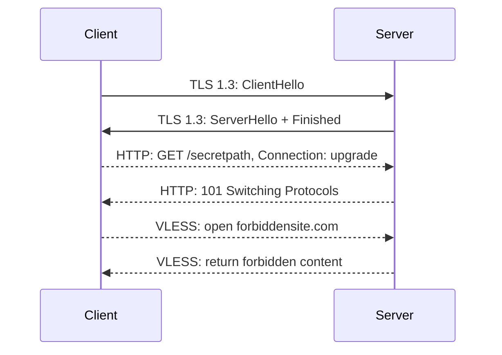
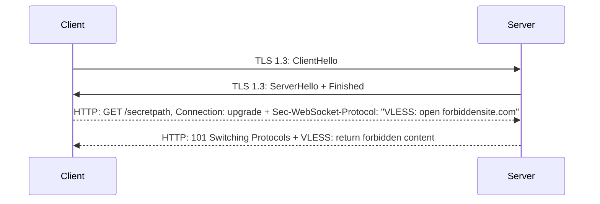

Any given v2ray config does not just "have" 0-RTT or not have it.

It's a property of a specific protocol layer, and your config is made of
multiple layers. In this order, from outer to inner layer:

* TCP, UDP
* TLS layer, optional
* Transport layer, optional
* Mux, optional
* "The protocol", e.g. VLESS or Vmess

Each of these layers "is 0-RTT"... or isn't. What that really means is: Does
the given layer add a roundtrip when creating a full connection (and therefore
increase latency), or does it not?

## Simple example: WebSocket without ED

Imagine your latency to send some data to the server is 100ms. This is what
happens when a new connection is established (let's just ignore TCP for this
article):

1. Client sends ClientHello, and waits for the server to respond with
   ServerHello. **200ms added**, because you're waiting for the data to
   transmit in both directions.
2. Then, client starts sending a HTTP request for WebSocket, and waits for the
   response. This is another **200ms added.**
3. Finally, the client can start forwarding the actual traffic.

This double-roundtrip is why URLTest may be slow (200ms + 200ms + ...), because
it establishes a new connection, but once the connection is established, the
ping in speedtest is a bit nicer.

In this example, it can be said that VLESS does not add latency, so VLESS "is
0-RTT". The same holds true for Trojan.

## Eliminating WebSocket RTT with Early Data

WebSocket adds the roundtrip of a HTTP request, let's get rid of it.

It was already briefly described in [Transports](./transports.md), but let's
actually sketch it out:

The amount of data that is sent around hasn't actually changed. We just
"batched" it efficiently into two roundtrips instead of three:

1. TLS handshake as normal.
2. Client sends the HTTP request together with the first half of VLESS traffic already.

   Server responds to the HTTP request and already sends the VLESS response
   (instead of waiting for a VLESS request to open forbiddensite)

### What about protocols other than WebSocket?

If you don't use WebSocket but for example TCP ("no transport"), gRPC or
SplitHTTP, those protocols don't add a roundtrip to begin with. So there is no
added latency that has to be "reverted".

HTTPUpgrade has the same issues as WebSocket, see [Transports](./transports.md).

## Eliminating TLS RTT

As a user of v2ray, there isn't really much you can do to remove the overhead of TLS.

* You can just turn off TLS. Just kidding, please don't.
* TLS 1.3 Early Data is the same idea as WebSocket Early Data: Take the HTTP
  request, and send it alongside with ClientHello. Unfortunately [this
  compromises
  security](https://blog.trailofbits.com/2019/03/25/what-application-developers-need-to-know-about-tls-early-data-0rtt/)
  to a certain degree. And it is not supported by uTLS or Golang's TLS.

### What about QUIC 0-RTT?

It seems to be largely the same situation. The library support is unclear, and
it compromises forward security in the same way.
